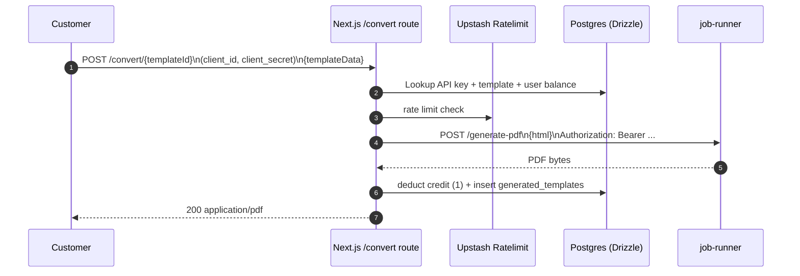
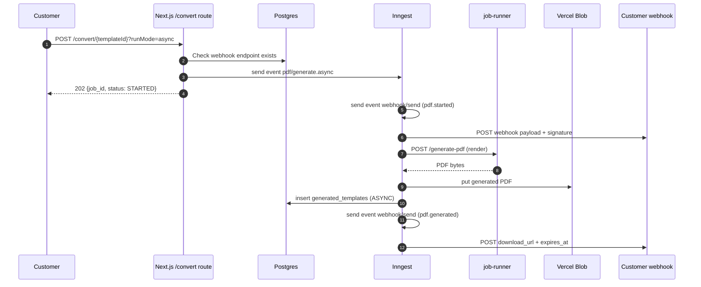

# Technical Context Document

This document explains **how this system works** and **why it is designed this way**, explicitly aligned to the product intent and constraints described in `context/BUSINESS_CONTEXT.md`.

## 1. System Overview

Templify’s dashboard repository implements:

- **A developer-facing dashboard** for authoring templates, managing webhook configuration, and viewing usage.
- **An API surface** that turns a stored template + JSON input into a PDF, supporting both:
  - **Synchronous** responses (`POST /convert/{templateId}` returns the PDF bytes).
  - **Asynchronous** execution gated by webhook configuration (`runMode=async` or `Prefer: respond-async`), emitting `pdf.started`, `pdf.generated`, and `pdf.failed` webhook events.
- **An onboarding accelerator** that imports a PDF into editable HTML via a background extraction flow.

Why this repo is structured around orchestration rather than “rendering engines”:

- Business context explicitly frames the product as “generate PDFs **without building and maintaining PDF rendering infrastructure**” and calls out reliability + async options as key value points. This repository focuses on **template lifecycle + orchestration + metering + delivery**, while delegating heavyweight conversion work to dedicated services.

## 2. Architecture Overview

### Primary components (within `dashboard/`)

- **Next.js application** (App Router):
  - Dashboard UI under `src/app/[locale]/(auth)/dashboard/...` (Clerk-authenticated).
  - Public-ish API routes under `src/app/[locale]/...` (notably `/convert/[templateId]/route.ts`).
  - Inngest function endpoint at `src/app/[locale]/api/inngest/route.ts`.

- **Database access layer (Drizzle ORM)**:
  - Schema in `src/models/Schema.ts`.
  - Connection in `src/libs/DB.ts` (Postgres via Neon serverless driver).

- **Background orchestration (Inngest)**:
  - Client: `src/inngest/client.ts`
  - Functions:
    - PDF→HTML extraction: `src/inngest/functions/extractPdf/*`
    - Template preview generation: `src/inngest/functions/generatePreview/*`
    - Async PDF generation: `src/inngest/functions/generatePdfAsync/index.ts`
    - Webhook delivery: `src/inngest/functions/webhook/sendWebhook.ts`

- **Storage (Vercel Blob)**:
  - Uploads for PDF→HTML: `uploads/{uuid}/input/in.pdf`
  - Async generated PDFs: `generated-pdf/{clientId}/{date}/{runId}.pdf`
  - Template preview PDFs: `{templateId}.pdf` (dev preview)

- **Rate limiting**:
  - Upstash Redis + `@upstash/ratelimit` in the `/convert` route.

- **Observability + product analytics**:
  - Sentry for Next.js (`src/instrumentation.ts` + `sentry.*.config.ts`).
  - PostHog event capture (`src/libs/analytics/posthog-server.ts`).

### External services (present in the broader workspace)

- **`job-runner/`**: PDF generation service (Express) backed by Chromium/Puppeteer (and a browser pool). Dashboard calls it via:
  - `JOB_RUNNER_BASE_URL/generate-pdf` with `Authorization: Bearer ${JOB_RUNNER_TOKEN}`.

- **`pdf2llm2html/`**: PDF→HTML conversion service (FastAPI) using OpenAI Vision and parallel per-page processing. Dashboard calls it via:
  - `PDF_TO_HTML_BASE_URL/convert` with `Authorization: Bearer ${PDF_TO_HTML_TOKEN}` (note: auth enforcement is currently network/ingress-based; in-app auth is backlog).

### System context diagram

```mermaid
flowchart LR
  Dev[Developer / Dashboard User] -->|Clerk auth| Next[Next.js Dashboard (this repo)]
  CustomerSys[Customer system] -->|API call: POST /convert/{templateId}| Next

  Next --> DB[(Postgres via Drizzle)]
  Next --> Upstash[(Upstash Redis\nRate limit)]
  Next --> Inngest[(Inngest\nEvent orchestration)]
  Next --> Blob[(Vercel Blob)]

  Inngest --> JobRunner[job-runner\n/generate-pdf]
  Inngest --> Pdf2Html[pdf2llm2html\n/convert]
  Inngest --> CustomerWH[Customer webhook endpoint]
```

## 3. Execution Model

### 3.1 Request flow: synchronous PDF generation

Entry point: `src/app/[locale]/convert/[templateId]/route.ts` (POST)

High-level steps:

1. **Authenticate API credentials**: `client_id` + `client_secret` headers are verified against stored credentials.
2. **Rate limit** (Upstash): sliding window 4 req / 60s per `client_id`.
3. **Load template** by `templateId` and `environment` (dev/prod; dev is default unless `devMode=false` is passed).
4. **Render HTML** by compiling the stored Handlebars template with provided `templateData` (or sample data).
5. **Generate PDF bytes** by calling `job-runner` (`JOB_RUNNER_BASE_URL/generate-pdf`).
6. **Enforce metering**: if this is an API call (`isApi=true`), check and deduct credits (currently per Clerk user id).
7. **Record usage** in `generated_templates` and return the PDF response.



### 3.2 Request flow: asynchronous PDF generation + webhooks

Entry point: same route as sync (`/convert/{templateId}`), triggered when:

- `Prefer: respond-async`, or
- `runMode=async`

Key business constraint implemented in code:

- **Async mode requires a configured webhook endpoint** (policy in `context/BUSINESS_CONTEXT.md`).

Flow:

1. Validate feature flag + webhook endpoint exists for this `client_id`.
2. Emit Inngest event `pdf/generate.async`.
3. In background:
   - Send `pdf.started` webhook event.
   - Generate PDF (job-runner), upload to Blob, persist history.
   - Send `pdf.generated` with `download_url` and computed `expires_at` (expiration is informational today; enforcement is planned).



### 3.3 Template preview generation (background)

When a template is saved/updated (dev environment), the system emits `template/generate-preview`. The Inngest function:

- Generates a PDF preview from the template (using the same PDF generation path).
- Uploads it to Blob.
- Updates `templates.previewURL`.

This matches the business requirement of fast iteration (“preview generation runs in the background”).

### 3.4 PDF→HTML extraction (onboarding accelerator)

The dashboard provides a PDF import UI (`src/components/template/PDFExtractor.tsx`) with a 4MB client-side limit. The flow is:

1. Upload PDF to Vercel Blob (`POST /api/upload`).
2. Trigger Inngest event `upload/extract.html`.
3. Inngest function:
   - Fetches the Blob download URL.
   - Calls `pdf2llm2html /convert` with `pdf_url`.
   - Returns extracted HTML in the job output, which the UI polls.

Business alignment: this is the “onboarding accelerator (PDF→HTML extraction)” workflow called out in `context/BUSINESS_CONTEXT.md`.

## 4. Data & State Management

### Primary datastore: Postgres (Drizzle)

Key tables (see `src/models/Schema.ts`):

- **`users`**
  - `clientId` is the Clerk user id.
  - `remainingBalance` is the credit balance (current scope: per user).

- **`apikeys`**
  - Stores an encrypted `clientSecret` used for API auth via headers.

- **`templates`**
  - `templateId` (stable identifier across environments)
  - `environment` (`dev` or `prod`)
  - `templateContent` (Handlebars template)
  - `templateSampleData`, `templateStyle`, `assets`, `previewURL`
  - Promotion copies dev → prod by upserting a prod row.

- **`generated_templates`**
  - Records generation activity, stores optional `generated_pdf_url` for async mode, and `mode` (`SYNC`/`ASYNC`).

- **Credits**
  - `credit_transactions` record top-ups (trial crediting is performed on `user.created` Clerk webhook).
  - Deduction is currently a decrement of `users.remainingBalance`.

- **Webhooks**
  - `webhook_endpoints`: per-user endpoint + encrypted secret
  - `webhook_events`: persistent event payload record
  - `webhook_deliveries`: attempt tracking and last response info

### Consistency + idempotency notes (as implemented)

- Template promotion is “copy + upsert” for prod; there’s no explicit version graph beyond timestamps and `templateGeneratedFrom`.
- Async PDF generation records `generated_templates` after upload; however:
  - Credit deduction occurs after successful PDF bytes generation (before upload), which creates an edge case where upload failure can still consume credits (tracked as backlog).

## 5. External Dependencies

### Authn/Authz

- **Clerk** for dashboard login and user identity (`users.clientId`).
- **Clerk webhooks** (`src/app/[locale]/api/webhook/clerk/route.ts`) create a user record, generate API key, and apply trial credits (150).

### PDF generation service: `job-runner`

- API: `POST /generate-pdf` expects `{ html }`, returns PDF bytes.
- Security: bearer token middleware.
- Implementation uses Puppeteer with a simple browser pool; this keeps the dashboard stateless and aligns with the business goal of not operating a PDF rendering stack inside the core app.

### PDF→HTML service: `pdf2llm2html`

- API: `POST /convert` expects `{ pdf_url, ... }`, returns `{ html, pages_processed, ... }`.
- Uses OpenAI Vision per page with retries (tenacity) and optional parallelism.
- Current security posture in production is network-level protection (in-app bearer auth is backlog).

### Storage + rate limiting

- Vercel Blob for uploads and generated artifacts.
- Upstash Redis for rate limiting.

### Observability + analytics

- Sentry (Next.js app, and separately `job-runner` uses Sentry SDK).
- PostHog capture for key product and API events.

## 6. Key Technical Decisions

- **Split orchestration vs conversion engines**:
  - The dashboard orchestrates templates, jobs, credits, and delivery.
  - Conversion engines live in dedicated services (`job-runner`, `pdf2llm2html`).
  - This matches the product premise in `context/BUSINESS_CONTEXT.md`: teams should not have to maintain rendering infrastructure.

- **Dev/prod templates as data, not branches**:
  - Dev/prod are represented as separate rows in `templates` keyed by (`templateId`, `environment`).
  - Promotion is an explicit action, matching the “publish gate” business workflow.

- **Async mode is webhook-gated**:
  - `handleAsyncMode` checks for a webhook endpoint before accepting async jobs.
  - This encodes the business policy “async requires webhooks”.

- **Webhook signing**:
  - Webhook payloads are signed with `x-templify-signature` (HMAC-SHA256) using an encrypted secret stored per user.
  - This supports safe delivery to customer systems (integrations domain).

## 7. Failure Modes & Reliability

### Current behavior (as implemented today)

- **API request failures** return structured JSON errors and log PostHog events.
- **Async PDF generation failure** triggers a `pdf.failed` webhook event.
- **Webhook delivery failures** are recorded in `webhook_deliveries` with status and last HTTP code/error.
- **PDF URL expiration** is emitted to customers but not enforced.
- **PDF→HTML extraction** currently allows partial page failures at the `pdf2llm2html` service level (placeholder HTML); product intent is to treat any page failure as a hard failure (backlog).

### Confirmed intent (needs implementation)

Business context says webhook delivery is “best-effort with automatic retries via orchestration”. You confirmed:

- The system **should retry webhook delivery automatically**.

This requires aligning `sendWebhook` behavior with Inngest retry semantics (e.g., throwing on retryable failures so the orchestration layer retries).

## 8. Security & Access Control

- **Dashboard authentication**: Clerk middleware protects `/dashboard` routes (`src/middleware.ts`).
- **API authentication**: `client_id` and `client_secret` headers are verified (`authenticateApi`).
- **Secrets at rest**:
  - API keys and webhook secrets are encrypted using `ENCRYPTION_KEY` (`src/service/crypto.ts`).
  - `ENCRYPTION_KEY` is a required runtime invariant (you confirmed); central env validation/enforcement is backlog.
- **Webhook integrity**:
  - HMAC signature header `x-templify-signature` over the JSON payload.
  - Customers are provided signature verification examples in UI.

## 9. Observability & Operations

- **Sentry**: request error capture and runtime instrumentation in Next.js.
- **PostHog**: business/activation events and API success/failure instrumentation.
- **Checkly**: synthetic monitoring config exists (`checkly.config.ts`).

Operational notes observed in repo:

- `job-runner` has Docker-based staging/prod deployment scripts and a load-test setup (`k6/`).
- This dashboard repo previously had an experimental standalone worker entrypoint; it was removed (confirmed as unintended).

## 10. Scalability & Evolution

Expected scaling path implied by current design:

- Scale dashboard independently from conversion services (web/API traffic vs CPU-heavy render/extraction).
- Increase async throughput by tuning Inngest concurrency and isolating conversion capacity in `job-runner`.
- Introduce retention/cleanup jobs for Blob artifacts as product expectations solidify (business context notes intended 24h expiry).
- Tighten security boundaries as services mature:
  - Enforce in-app auth on `pdf2llm2html`.
  - Centralize env validation for cryptographic invariants.

Known limits/guardrails currently in place:

- API rate limiting (4 requests / 60 seconds per user).
- Preview generation concurrency limit (3).

## 11. Assumptions & Open Questions

### Confirmed assumptions

- Inngest executes via `src/app/[locale]/api/inngest/route.ts` (no separate worker service).
- Credits are scoped per Clerk user id (`users.clientId`), not per environment and not per org (for now).
- Any page failure in PDF→HTML extraction should fail the overall extraction job.
- Webhook delivery should be retried automatically.

### Backlog / known gaps (explicit)

- **Webhook retries**: make webhook delivery retryable at the orchestration layer (align `sendWebhook` with Inngest retry semantics while preserving delivery audit trails).
- **PDF→HTML hard-fail**: treat any page-level failure as a job-level failure (either enforce in `pdf2llm2html` or validate/abort in the dashboard’s extraction job).
- **`pdf2llm2html` bearer auth**: enforce token validation in-app; current protection is network/private ingress.
- **`ENCRYPTION_KEY` enforcement**: validate as a required production env var at startup (centralized).
- **Async “success” semantics for credits**: handle the edge case where PDF bytes are generated but Blob upload fails (currently may consume credits and not emit `pdf.generated`).
- **Blob retention/cleanup**: enforce the intended 24h expiry for async download URLs and decide what “expiry” means operationally (delete blobs vs revoke URLs vs lifecycle policy).
- **Update business documentation**: align `context/BUSINESS_CONTEXT.md` to reflect the implemented credit scope (per user, not per environment).
