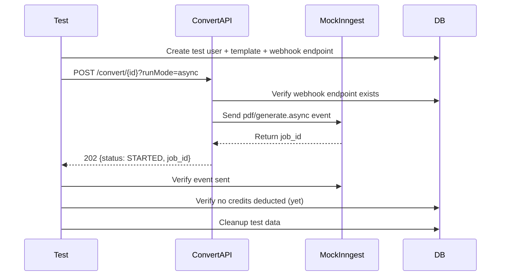

# Story 3: Async Mode & Webhook Delivery Integration Tests

## Business Context

Asynchronous PDF generation is a critical feature that enables customers to process long-running or high-volume document generation without blocking their applications. This workflow involves multiple components: async request validation, background job orchestration via Inngest, webhook event delivery, and signature verification for security.

Unlike synchronous PDF generation, async mode has additional failure modes:
- Missing webhook configuration (business requirement)
- Inngest event orchestration failures
- Webhook delivery failures or signature mismatches
- Blob storage upload failures
- Incorrect job status tracking

Currently, there is no automated test coverage for the async PDF generation workflow. Manual testing is time-consuming and doesn't catch regressions in the complex interaction between the convert API, Inngest functions, webhook delivery, and storage. Without these tests, changes to async logic risk breaking customer integrations that depend on webhook notifications.

This story establishes integration test coverage for the complete async PDF generation and webhook delivery workflow, protecting customers who rely on asynchronous processing for their production systems.

## Story Text

**As a** Product Owner  
**I want** automated integration tests for async PDF generation and webhook delivery workflows  
**So that** customers using async mode receive reliable webhook notifications and our team can confidently evolve the async infrastructure without breaking integrations

## Acceptance Criteria

### AC1: Async Mode Trigger - Header (Prefer: respond-async)
**Given** a valid template and webhook endpoint are configured  
**And** the request includes the header `Prefer: respond-async`  
**When** the convert API is called  
**Then** the API returns a 202 status code  
**And** the response includes `Preference-Applied: respond-async` header  
**And** the response body contains `{ template_id, status: "STARTED", job_id }`  
**And** an Inngest event `pdf/generate.async` is triggered  
**And** no immediate PDF generation occurs (deferred to background)

### AC2: Async Mode Trigger - Query Parameter (runMode=async)
**Given** a valid template and webhook endpoint are configured  
**And** the request includes query parameter `?runMode=async`  
**When** the convert API is called  
**Then** the API returns a 202 status code  
**And** the response body contains `{ template_id, status: "STARTED", job_id }`  
**And** an Inngest event `pdf/generate.async` is triggered  
**And** the behavior is identical to using the `Prefer` header

### AC3: Async Mode Blocked - Feature Flag Disabled
**Given** the `FEATURE_PDF_ASYNC` feature flag is disabled  
**And** a request is made with async mode (`runMode=async` or `Prefer: respond-async`)  
**When** the convert API processes the request  
**Then** the API returns a 403 status code  
**And** the error message indicates async PDF generation is disabled  
**And** no Inngest event is triggered

### AC4: Async Mode Blocked - No Webhook Endpoint Configured
**Given** a valid template exists  
**And** the user has NOT configured a webhook endpoint  
**And** a request is made with async mode  
**When** the convert API processes the request  
**Then** the API returns a 400 status code  
**And** the error message indicates: "Webhook endpoint is not configured for this user. Please open settings and add a webhook URL under the Webhook Configuration."  
**And** no Inngest event is triggered  
**And** no credits are deducted

### AC5: Async Mode with Authentication Failure
**Given** a webhook endpoint is configured  
**And** the request includes invalid or missing API credentials  
**When** the convert API is called with async mode  
**Then** the API returns a 401 status code  
**And** authentication fails before checking webhook configuration  
**And** no Inngest event is triggered

### AC6: Inngest Event Payload Verification
**Given** a valid async request is accepted  
**When** the Inngest event `pdf/generate.async` is triggered  
**Then** the event payload contains:
  - `clientId` (user identifier)
  - `templateId` (template identifier)
  - `templateData` (input data provided or empty object)
  - `devMode` (boolean indicating dev/prod environment)
  - `endpointId` (webhook endpoint database ID)
  - `endpointUrl` (webhook URL)
  - `encryptedSecret` (encrypted webhook secret)  
**And** all required fields are present and correctly typed  
**And** the test can verify the event was sent with exact payload

### AC7: Webhook Event - pdf.started
**Given** an Inngest async job is triggered  
**When** the background function begins execution  
**Then** a `webhook/send` Inngest event is triggered with type `pdf.started`  
**And** the webhook payload includes:
  - `type: "pdf.started"`
  - `meta.template_id` (template identifier)
  - `meta.job_id` (Inngest run ID)
  - `meta.input_data` (original templateData)  
**And** the webhook endpoint URL and encrypted secret are included  
**And** tests can verify this event was sent before PDF generation begins

### AC8: Webhook Event - pdf.generated (Success)
**Given** async PDF generation completes successfully  
**When** the PDF is uploaded to Blob storage  
**Then** a `webhook/send` Inngest event is triggered with type `pdf.generated`  
**And** the webhook payload includes:
  - `type: "pdf.generated"`
  - `data.template_id` (template identifier)
  - `data.job_id` (Inngest run ID)
  - `data.download_url` (Blob storage URL)
  - `data.render_ms` (generation time in milliseconds)
  - `data.expires_at` (ISO timestamp, 24 hours from generation)  
**And** the test verifies the download URL matches the mock Blob URL  
**And** the expires_at timestamp is approximately 24 hours in the future

### AC9: Webhook Event - pdf.failed (Failure)
**Given** async PDF generation fails (e.g., job-runner error)  
**When** the background function catches the error  
**Then** a `webhook/send` Inngest event is triggered with type `pdf.failed`  
**And** the webhook payload includes:
  - `type: "pdf.failed"`
  - `data.error.code` (error code, e.g., "PDF_GENERATION_FAILED")
  - `data.error.message` (error description)
  - `data.render_ms` (time before failure)
  - `meta.template_id` (template identifier)
  - `meta.job_id` (Inngest run ID)  
**And** no PDF is uploaded to Blob storage  
**And** no database record is created in generated_templates

### AC10: Webhook Signature Verification
**Given** webhook events are sent to customer endpoints  
**When** a webhook payload is prepared for delivery  
**Then** the webhook includes header `x-templify-signature` with HMAC-SHA256 signature  
**And** the signature is calculated as: `sha256(webhook_secret, JSON.stringify(payload))`  
**And** the encrypted secret is decrypted before signing  
**And** tests can verify the signature matches expected value for a given payload

### AC11: Database Record Creation (Async Mode)
**Given** async PDF generation completes successfully  
**When** the PDF is uploaded and webhook is sent  
**Then** a record is created in `generated_templates` table with:
  - `templateId` (template identifier)
  - `dataValue` (input templateData)
  - `inngestJobId` (Inngest run ID)
  - `generatedPdfUrl` (Blob storage URL)
  - `mode: "ASYNC"`  
**And** the record is created AFTER PDF upload succeeds  
**And** tests can query the database to verify the record

### AC12: Blob Storage Upload Path
**Given** async PDF generation completes successfully  
**When** the PDF is uploaded to Vercel Blob  
**Then** the storage path follows the pattern: `generated-pdf/{clientId}/{date}/{runId}.pdf`  
**And** `{date}` is formatted as `DD-MM-YYYY` (e.g., "20-1-2026")  
**And** `{runId}` is the Inngest run ID  
**And** the blob is uploaded with:
  - `access: "public"`
  - `contentType: "application/pdf"`
  - `addRandomSuffix: false`  
**And** tests can verify the mock Blob service received correct upload parameters

### AC13: Async Mode Does Not Deduct Credits Immediately
**Given** an async request is accepted and returns 202  
**When** the initial API call completes  
**Then** no credits are deducted from the user's balance  
**And** credits are only deducted when the background job successfully generates the PDF  
**And** tests verify user balance remains unchanged after 202 response

### AC14: Async Mode Credits Deducted on Success
**Given** an async PDF generation job completes successfully  
**When** the PDF is generated and uploaded  
**Then** 1 credit is deducted from the user's balance  
**And** the deduction occurs via the `generatePdf` function (same as sync mode)  
**And** tests verify user balance decreased by 1 after successful generation

### AC15: Async Mode No Credits Deducted on Failure
**Given** an async PDF generation job fails  
**When** the error is caught and `pdf.failed` event is sent  
**Then** no credits are deducted from the user's balance  
**And** tests verify user balance remains unchanged after failure

### AC16: Environment Handling (Dev vs Prod)
**Given** async requests can specify `devMode` parameter  
**When** `devMode=true` (or omitted, default is true)  
**Then** the dev environment template is used  
**And** the `devMode` flag is passed through to Inngest event  
**When** `devMode=false`  
**Then** the prod environment template is used  
**And** tests verify correct environment template is used in async jobs

### AC17: Multiple Webhook Events Are Independent
**Given** multiple async jobs are triggered for different templates  
**When** each job sends its own webhook events  
**Then** webhook events are isolated per job (correct job_id, template_id)  
**And** events for one job do not interfere with another  
**And** tests can verify event isolation using different clientIds or templateIds

### NFR1: Test Isolation
**Given** multiple async workflow tests run  
**When** tests execute in parallel or sequentially  
**Then** each test creates its own webhook endpoint configuration  
**And** mock Inngest events are scoped to individual tests  
**And** mock Blob uploads are tracked per test  
**And** tests clean up all webhook endpoints and events after execution

### NFR2: Test Maintainability
**Given** async tests involve complex workflows  
**When** tests are written  
**Then** shared helpers exist for:
  - Creating test webhook endpoints
  - Mocking Inngest event sending
  - Mocking Blob uploads
  - Verifying webhook event payloads
  - Calculating and verifying HMAC signatures  
**And** test fixtures provide realistic webhook payloads  
**And** async event verification helpers are reusable

### NFR3: CI/CD Integration
**Given** async tests are implemented  
**Then** tests run in GitHub Actions pipeline  
**And** mock Inngest client prevents actual event delivery in CI  
**And** tests complete within 60 seconds per test  
**And** test failures clearly indicate which async component failed

## Out of Scope

- Actual webhook HTTP delivery to external endpoints (mock verification only)
- Webhook retry logic (defer to separate story or covered by Inngest platform)
- Inngest function execution (only verify events are triggered with correct payloads)
- Real Blob storage operations (mocked)
- Real job-runner service calls (mocked, same as Story 1)
- Webhook delivery observability (webhook_deliveries table tracking - separate story)
- Webhook endpoint configuration UI testing (E2E scope)
- Load testing async job throughput
- Blob URL expiration enforcement (planned feature, not implemented)

## Dependencies

**Story 0: Setup Integration Test Infrastructure** (MUST be completed first)
- Mock Inngest client for event verification
- Mock Vercel Blob for upload verification
- Test database and fixtures

**Story 1: Core Convert API Integration Tests** (RECOMMENDED to be completed first)
- Establishes convert API testing patterns
- Provides shared test helpers and fixtures

## Assumptions

- `FEATURE_PDF_ASYNC` is enabled during testing (or tests control feature flag)
- Mock Inngest allows verification of events sent without executing functions
- Webhook signing uses HMAC-SHA256 (current implementation)
- Encrypted secrets can be decrypted in tests (test encryption key available)
- Webhook endpoint configuration exists in database (created by test fixtures)
- Tests mock Inngest function execution (don't actually run background jobs)
- Mock Blob service returns predictable URLs for verification
- Credits are tracked per user (clientId), not per organization (current scope)
- Blob URLs expire in 24 hours (informational, enforcement not tested)
- Tests verify Inngest events are triggered, but don't execute the full Inngest function
- Webhook delivery HTTP calls are mocked (actual delivery tested separately or manually)
- Test database supports webhook_endpoints table queries

## Supporting Documentation

### Recommended Test Structure
```
tests/
└── integration/
    └── convert-api/
        ├── async-request-handling.test.ts      # AC1-AC6
        ├── async-webhook-events.test.ts        # AC7-AC10
        ├── async-database-storage.test.ts      # AC11-AC12
        ├── async-credits-metering.test.ts      # AC13-AC15
        ├── async-environment.test.ts           # AC16-AC17
        └── fixtures/
            ├── test-webhook-endpoints.ts
            ├── mock-inngest-events.ts
            └── webhook-signatures.ts
```

### Example Test: Async Request with Webhook Verification

```typescript
// tests/integration/convert-api/async-request-handling.test.ts
import { describe, it, expect, beforeEach, afterEach } from 'vitest';
import { createTestUser, createTestTemplate, createTestWebhookEndpoint, cleanupTestData } from '../fixtures/test-users';
import { mockInngest, verifyInngestEvent } from '../mocks/mock-inngest';
import { POST } from '@/app/[locale]/convert/[templateId]/route';

describe('Async PDF Generation - Request Handling', () => {
  let testUser: any;
  let testTemplate: any;
  let webhookEndpoint: any;

  beforeEach(async () => {
    testUser = await createTestUser();
    testTemplate = await createTestTemplate(testUser.email);
    webhookEndpoint = await createTestWebhookEndpoint(testUser.clientId);
    mockInngest.reset();
  });

  afterEach(async () => {
    await cleanupTestData();
  });

  it('AC1: should trigger async mode with Prefer: respond-async header', async () => {
    // Arrange
    const request = new Request(`http://localhost/convert/${testTemplate.templateId}`, {
      method: 'POST',
      headers: {
        'client_id': testUser.clientId,
        'client_secret': testUser.apiKey,
        'Content-Type': 'application/json',
        'Prefer': 'respond-async',
      },
      body: JSON.stringify({
        templateData: { name: 'Async Test' }
      }),
    });

    // Act
    const response = await POST(request, { params: { templateId: testTemplate.templateId } });

    // Assert - Response
    expect(response.status).toBe(202);
    expect(response.headers.get('Preference-Applied')).toBe('respond-async');
    
    const body = await response.json();
    expect(body).toMatchObject({
      template_id: testTemplate.templateId,
      status: 'STARTED',
      job_id: expect.any(String),
    });

    // Assert - Inngest Event
    const inngestEvents = mockInngest.getEvents();
    expect(inngestEvents).toHaveLength(1);
    expect(inngestEvents[0]).toMatchObject({
      name: 'pdf/generate.async',
      data: {
        clientId: testUser.clientId,
        templateId: testTemplate.templateId,
        templateData: { name: 'Async Test' },
        devMode: true,
        endpointId: webhookEndpoint.id,
        endpointUrl: webhookEndpoint.url,
        encryptedSecret: expect.any(String),
      },
    });

    // Assert - No immediate credit deduction
    const updatedUser = await getUserById(testUser.clientId);
    expect(updatedUser.remainingBalance).toBe(testUser.remainingBalance);
  });

  it('AC4: should reject async mode when webhook endpoint is not configured', async () => {
    // Arrange - Delete webhook endpoint
    await deleteWebhookEndpoint(webhookEndpoint.id);

    const request = new Request(`http://localhost/convert/${testTemplate.templateId}?runMode=async`, {
      method: 'POST',
      headers: {
        'client_id': testUser.clientId,
        'client_secret': testUser.apiKey,
        'Content-Type': 'application/json',
      },
      body: JSON.stringify({
        templateData: { name: 'Test' }
      }),
    });

    // Act
    const response = await POST(request, { params: { templateId: testTemplate.templateId } });

    // Assert
    expect(response.status).toBe(400);
    const body = await response.json();
    expect(body.error).toContain('Webhook endpoint is not configured');

    // Verify no Inngest event was triggered
    expect(mockInngest.getEvents()).toHaveLength(0);

    // Verify no credits deducted
    const updatedUser = await getUserById(testUser.clientId);
    expect(updatedUser.remainingBalance).toBe(testUser.remainingBalance);
  });
});
```

### Mock Inngest Helper

```typescript
// mocks/mock-inngest.ts
import { vi } from 'vitest';

type InngestEvent = {
  name: string;
  data: any;
};

class MockInngestClient {
  private events: InngestEvent[] = [];

  async send(event: InngestEvent) {
    this.events.push(event);
    // Return mock job ID
    return { ids: [`job_${Math.random().toString(36).substring(7)}`] };
  }

  getEvents() {
    return this.events;
  }

  getEventsByName(name: string) {
    return this.events.filter(e => e.name === name);
  }

  reset() {
    this.events = [];
  }
}

export const mockInngest = new MockInngestClient();

// Mock the Inngest client module
vi.mock('@/inngest/client', () => ({
  inngest: mockInngest,
}));
```

### Webhook Signature Helper

```typescript
// fixtures/webhook-signatures.ts
import crypto from 'crypto';
import { decrypt } from '@/service/crypto';

export function calculateWebhookSignature(
  payload: any,
  encryptedSecret: string
): string {
  const secret = decrypt(encryptedSecret);
  const payloadString = JSON.stringify(payload);
  
  const hmac = crypto.createHmac('sha256', secret);
  hmac.update(payloadString);
  
  return `sha256=${hmac.digest('hex')}`;
}

export function verifyWebhookSignature(
  payload: any,
  signature: string,
  encryptedSecret: string
): boolean {
  const expectedSignature = calculateWebhookSignature(payload, encryptedSecret);
  
  return crypto.timingSafeEqual(
    Buffer.from(signature),
    Buffer.from(expectedSignature)
  );
}
```

### Sequence Diagram: Async Workflow Test Flow


