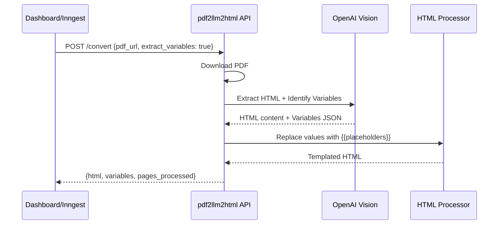

# Story 1: AI Variable Identification & Replacement in pdf2llm2html Service

## Business Context

Currently, when users extract a template from a PDF using the pdf2llm2html service, they receive raw HTML with actual values embedded (e.g., "John Doe", "INV-001", "$1,234.56"). To make this HTML reusable as a template, users must manually identify which values should be dynamic variables and replace them with Handlebars placeholders (e.g., `{{customer_name}}`, `{{invoice_number}}`). This manual process is tedious, error-prone, and slows down the "time-to-first-template" metric—a key onboarding success indicator.

This story enhances the pdf2llm2html service to automatically identify dynamic variables using AI, perform reliable string replacement to create a templated HTML, and return both the transformed HTML and a sample data JSON. This improvement directly supports the "onboarding accelerator" value proposition by reducing friction in template creation.

## Story Text

**As a** developer using Templify to create templates from existing PDFs,

**I want** the pdf2llm2html service to automatically identify dynamic variables and replace them with Handlebars placeholders,

**So that** I receive a ready-to-use template with sample data instead of having to manually convert values to variables myself.

## Acceptance Criteria

### AC1: API accepts optional flag for variable extraction
**Given** the pdf2llm2html service receives a POST request to `/convert`
**When** the request includes `"extract_variables": true` in the payload
**Then** the service activates variable identification and replacement logic
**And** when the flag is `false` or omitted, the service behaves as before (returns plain HTML only)

### AC2: AI identifies dynamic variables from PDF content
**Given** a PDF with mixed static and dynamic content (e.g., invoice with "Invoice" as label and "INV-001" as number)
**When** the service processes the PDF with `extract_variables: true`
**Then** the AI analyzes each page and identifies values that appear to be dynamic data (names, dates, numbers, IDs, amounts, addresses, emails, etc.)
**And** creates a JSON object with variable names as keys and extracted values from the PDF as sample values
**And** variable names follow naming conventions: lowercase, snake_case, descriptive (e.g., `invoice_number`, `customer_name`, `total_amount`)

### AC3: System performs reliable string replacement
**Given** the AI has identified variables and their values
**When** the service performs string replacement on the extracted HTML
**Then** each identified value is replaced with its corresponding Handlebars placeholder `{{variable_name}}`
**And** the replacement is case-sensitive and exact-match to avoid partial replacements
**And** HTML structure, styling, and formatting remain intact

### AC4: Response includes both templated HTML and sample JSON
**Given** the pdf2llm2html service completes processing with `extract_variables: true`
**When** the service returns the response
**Then** the response includes:
```json
{
  "html": "<html>...{{variable_name}}...</html>",
  "variables": {
    "variable_name": "sample_value",
    ...
  },
  "pages_processed": 3
}
```
**And** the `html` field contains Handlebars placeholders
**And** the `variables` field contains the sample data JSON
**And** existing fields like `pages_processed` are still present

### AC5: Backward compatibility maintained
**Given** existing integrations call `/convert` without the `extract_variables` flag
**When** the service processes these requests
**Then** the service returns the response in the original format (HTML only)
**And** no errors or breaking changes occur

### AC6: Error handling for variable extraction failures
**Given** the AI fails to identify any variables (e.g., PDF contains only static content)
**When** the service processes the request
**Then** the service returns an empty variables object `"variables": {}`
**And** the HTML is returned as-is without placeholder replacements
**And** the response still includes `pages_processed`

**Given** the variable identification or replacement logic encounters an error
**When** the service processes the request
**Then** the service logs the error with relevant context
**And** falls back to returning plain HTML (as if `extract_variables: false`)
**And** includes an error indicator in the response (optional field: `"variable_extraction_error": true`)

## Out of Scope

- **User-editable variable names during extraction**: The AI assigns variable names automatically; user renaming happens in the dashboard UI (Story 3)
- **Handling duplicate variable names**: If AI generates duplicates, that's acceptable for this story; dashboard validation (Story 4) will catch it
- **Variable extraction accuracy guarantees**: No minimum accuracy threshold is enforced in this story (addressed in observability NFR story)
- **Handling 50+ variables in complex documents**: No upper limit on variable count in this story
- **Advanced variable type detection**: The AI identifies values that look dynamic, but doesn't categorize them by type (string vs number vs date, etc.)
- **Multi-language/special character handling**: Assumes English PDFs with standard character sets for MVP

## Dependencies

### External Dependencies
- **OpenAI Vision API** must be available and responsive
- **Existing pdf2llm2html conversion logic** must be working correctly

### Internal Dependencies
- None (this is the first story in the sequence)

## Assumptions

1. **AI Prompt Engineering**: The OpenAI Vision model (currently `gpt-4o-mini` per codebase) can identify dynamic variables with reasonable accuracy when given proper prompt instructions
2. **String Replacement Logic**: Exact string matching is sufficient for replacement (no need for regex or fuzzy matching)
3. **Variable Naming Convention**: Snake_case, lowercase variable names are acceptable for developers
4. **PDF Structure**: PDFs have extractable text content (not scanned images requiring OCR beyond current capabilities)
5. **Single-pass Processing**: Variable identification and replacement happen in a single processing pass (no iterative refinement)
6. **JSON Structure**: Flat JSON structure is sufficient (no nested objects for now)
7. **Token Limits**: Enhanced AI prompts for variable identification fit within OpenAI token limits
8. **Performance**: Additional AI processing for variable identification adds acceptable latency (no specific SLA in this story; measured in NFR story)

## Technical Notes

### Prompt Engineering Guidance
The AI prompt should instruct the model to:
- Identify values that appear to be data (not labels/headers)
- Recognize common patterns: invoice numbers, order IDs, names, dates, amounts, emails, phone numbers, addresses
- Generate descriptive variable names based on context
- Return variables in a structured JSON format

### String Replacement Implementation
- Use exact string matching (not regex) to avoid unintended replacements
- Process HTML content after extraction but before returning response
- Handle edge cases: multiple occurrences of same value, values within attributes vs text nodes
- Preserve HTML entity encoding

### API Contract Example

**Request:**
```json
POST /convert
Content-Type: application/json
Authorization: Bearer <token>

{
  "pdf_url": "https://storage.example.com/invoice.pdf",
  "extract_variables": true
}
```

**Response (Success):**
```json
{
  "html": "<html><body><h1>Invoice {{invoice_number}}</h1><p>Customer: {{customer_name}}</p><p>Total: {{total_amount}}</p></body></html>",
  "variables": {
    "invoice_number": "INV-12345",
    "customer_name": "John Doe",
    "total_amount": "$1,234.56"
  },
  "pages_processed": 1
}
```

**Response (No variables detected):**
```json
{
  "html": "<html><body><h1>Static Template</h1></body></html>",
  "variables": {},
  "pages_processed": 1
}
```

**Response (Flag omitted - backward compatible):**
```json
{
  "html": "<html><body><h1>Invoice INV-12345</h1></body></html>",
  "pages_processed": 1
}
```

### Sequence Diagram


