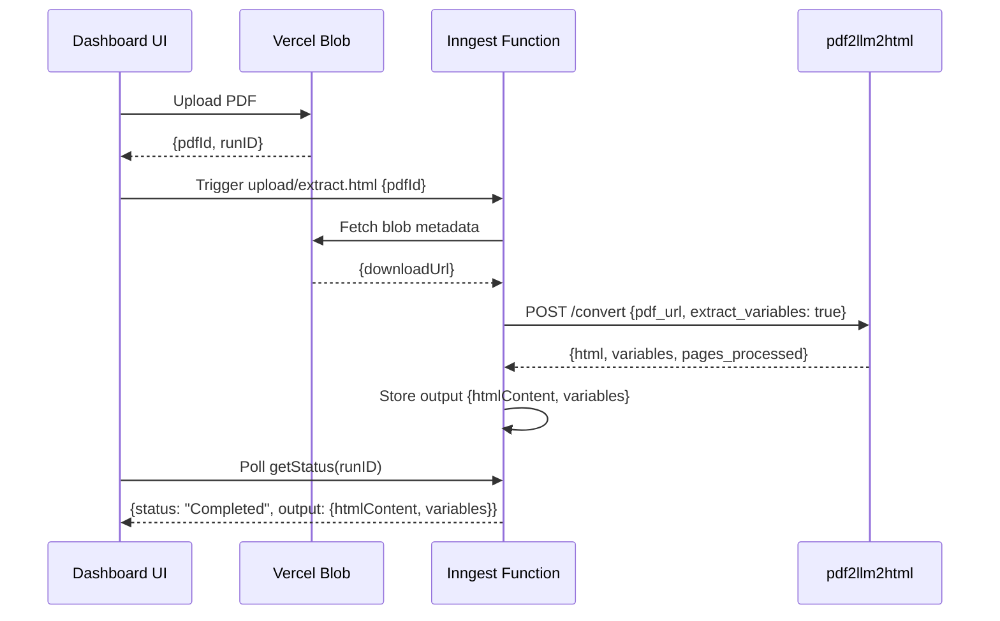

# Story 2: Dashboard/Inngest Integration for Variable Extraction

## Business Context

With Story 1 complete, the pdf2llm2html service can now identify variables and return templated HTML with sample data. However, the dashboard's PDF extraction flow (orchestrated via Inngest) still calls the service with the old contract and only expects HTML content back. To deliver value to users, we need to update the Inngest extraction job to request variable extraction and propagate both the templated HTML and sample data JSON to the dashboard UI, where users can review and confirm variables before creating their template.

This integration story connects the backend capability (Story 1) with the frontend experience (Stories 3 & 4), enabling the complete variable extraction workflow.

## Story Text

**As a** developer integrating PDF extraction into Templify,

**I want** the Inngest PDF extraction job to request variable identification from pdf2llm2html and return both templated HTML and sample data,

**So that** the dashboard UI receives the necessary data to show users the identified variables for review.

## Acceptance Criteria

### AC1: Inngest job passes extract_variables flag to pdf2llm2html
**Given** the Inngest function `extractPdfContent` is triggered by `upload/extract.html` event
**When** the function calls the `convertToHTML` helper to request PDF conversion
**Then** the request to pdf2llm2html includes `"extract_variables": true` in the payload
**And** the authorization header and pdf_url are still included as before

### AC2: Inngest job handles new response format with variables
**Given** pdf2llm2html returns the enhanced response with `{html, variables, pages_processed}`
**When** the Inngest function receives the response
**Then** the function extracts both `html` and `variables` from the response
**And** stores the `html` content for template creation
**And** stores the `variables` JSON object for sample data

### AC3: Inngest job output includes both HTML and variables
**Given** the Inngest function completes successfully
**When** the job returns its output
**Then** the output includes:
```json
{
  "htmlContent": "<html>...{{variable_name}}...</html>",
  "variables": {
    "variable_name": "sample_value",
    ...
  }
}
```
**And** the UI can poll this output via `getStatus(runID)` as before

### AC4: Handles response when no variables detected
**Given** pdf2llm2html returns `"variables": {}` (empty object)
**When** the Inngest function processes the response
**Then** the job output includes `"variables": {}`
**And** the job still completes successfully
**And** the `htmlContent` is returned (may or may not have placeholders)

### AC5: Backward compatibility with existing job polling
**Given** the dashboard UI polls job status via `getStatus(runID)`
**When** the job completes
**Then** the existing polling mechanism still works
**And** the response structure includes both `htmlContent` and `variables` fields
**And** existing code accessing `output.htmlContent` continues to work

### AC6: Error handling for missing variables field
**Given** pdf2llm2html returns a response without the `variables` field (e.g., service not yet updated, or flag not passed)
**When** the Inngest function receives this response
**Then** the function logs a warning about missing variables
**And** defaults `variables` to an empty object `{}`
**And** still returns the `htmlContent` successfully
**And** the job completes without throwing an error

### AC7: Error handling for pdf2llm2html service failures
**Given** the pdf2llm2html service returns an error or times out
**When** the Inngest function handles the error
**Then** the function logs the error with context (pdfId, error message)
**And** throws an error to mark the Inngest job as failed
**And** the error message indicates whether it was a network issue, service error, or timeout

### AC8: Logging includes variable extraction context
**Given** the Inngest function is processing a PDF
**When** key steps occur (API call, response received, variables extracted)
**Then** structured logs include relevant context:
- `extract_variables: true` in API call log
- Number of variables identified in response log
- Any warnings about missing or empty variables

## Out of Scope

- **UI changes to display variables**: Handled in Story 3
- **JSON validation of variables**: Handled in Story 4
- **Observability metrics**: Handled in Story 5 (NFR)
- **Retry logic for variable extraction failures**: Current Inngest retry behavior is sufficient
- **Caching of extraction results**: Not needed for MVP
- **Handling partial page failures with variables**: If extraction fails on any page, entire job fails (existing behavior)

## Dependencies

### Blocking Dependencies
- **Story 1 must be complete**: pdf2llm2html service must support `extract_variables` flag and return new response format
- **pdf2llm2html service deployed**: Updated service must be deployed to the environment where Inngest jobs run

### Non-blocking Dependencies
- **Vercel Blob storage** must be working (existing dependency)
- **Inngest platform** must be operational (existing dependency)

## Assumptions

1. **Single source of truth**: The `variables` JSON returned by pdf2llm2html is the authoritative source; Inngest doesn't transform or validate it
2. **Job output structure**: Inngest job output can include multiple fields, and existing polling code can handle additional fields
3. **PDF size limits**: Existing 4MB client-side limit remains in place; no changes to upload constraints
4. **Authentication**: Current bearer token auth for pdf2llm2html service is sufficient
5. **Network reliability**: HTTP calls to pdf2llm2html follow existing timeout/retry patterns (Inngest default retries)
6. **Deployment sequence**: pdf2llm2html (Story 1) will be deployed before this story's dashboard changes
7. **Environment configuration**: `PDF_TO_HTML_BASE_URL` and `PDF_TO_HTML_TOKEN` environment variables are correctly configured
8. **Response size**: The enhanced response (HTML + variables JSON) fits within Inngest job output size limits

## Technical Notes

### Files to Modify

**1. convertToHtml.ts**
- Update the POST request body to include `extract_variables: true`
- Update response typing to expect `{html, variables, pages_processed}`
- Return both html and variables

**2. index.ts**
- Update the function to handle new return value from `convertToHTML`
- Return both `htmlContent` and `variables` in job output
- Add error handling for missing variables field

**3. Type Definitions (if needed)**
- Create/update types for pdf2llm2html response format
- Create/update types for Inngest job output format

### Implementation Example

**Current convertToHtml.ts:**
```typescript
export async function convertToHTML(downloadUrl: string, logger: Logger) {
  const response = await axios.post(
    `${baseUrl}/convert`,
    { pdf_url: downloadUrl },
    { headers: { ... } }
  );
  return response.data.html;
}
```

**Updated convertToHtml.ts:**
```typescript
type Pdf2HtmlResponse = {
  html: string;
  variables?: Record<string, any>;
  pages_processed: number;
};

export async function convertToHTML(downloadUrl: string, logger: Logger) {
  const response = await axios.post<Pdf2HtmlResponse>(
    `${baseUrl}/convert`,
    {
      pdf_url: downloadUrl,
      extract_variables: true
    },
    { headers: { ... } }
  );

  const { html, variables = {}, pages_processed } = response.data;

  logger.info('Conversion completed', {
    pages_processed,
    variables_count: Object.keys(variables).length
  });

  return { html, variables };
}
```

**Updated index.ts:**
```typescript
export const extractPdfContent = inngest.createFunction(
  { id: 'extract-html' },
  { event: 'upload/extract.html' },
  async ({ event, step, logger }) => {
    const pdfId = event.data.pdfId;

    try {
      const { downloadUrl } = await step.run('fetch-blob-metadata', () =>
        fetchBlobMetadata(pdfId));

      const { html, variables } = await step.run('convert-to-html', () =>
        convertToHTML(downloadUrl, logger));

      logger.info('PDF Extraction Completed Successfully', {
        variables_count: Object.keys(variables).length
      });

      return {
        htmlContent: html,
        variables
      };
    } catch (error: any) {
      logger.error('PDF extraction failed', { error: error.message });
      throw new Error(`Error during PDF processing: ${error.message}`);
    }
  },
);
```

### Sequence Diagram



### Error Scenarios

| Scenario | Handling |
|----------|----------|
| pdf2llm2html returns 500 | Inngest job fails, error logged, UI shows extraction failed |
| pdf2llm2html times out | Axios timeout → Inngest job fails, retries per Inngest config |
| Response missing `variables` | Default to `{}`, log warning, job succeeds |
| `variables` is null | Treat as `{}`, log warning, job succeeds |
| Network error | Axios error → Inngest job fails, error logged |
| Invalid JSON in response | Axios parsing error → Inngest job fails |
