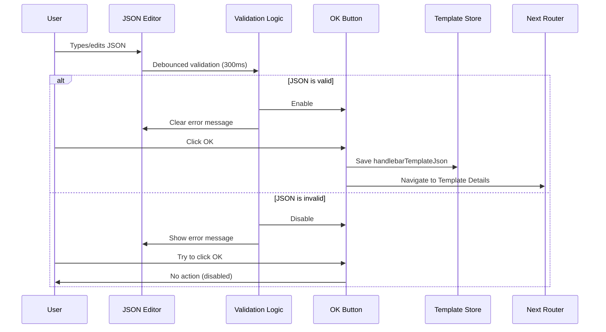

# Story 4: JSON Validation and Conditional "OK" Button

## Business Context

With Story 3 complete, users can now see and edit the variables JSON on the extraction success screen. However, users might introduce JSON syntax errors (missing commas, unclosed brackets, duplicate keys) while editing, which would break template creation downstream. To ensure data integrity and prevent frustrating errors later in the flow, we need to validate the JSON in real-time and only allow users to proceed when the JSON is valid.

This story adds client-side validation with clear error feedback and controls the "OK" button state, ensuring users can only advance to template creation when they have valid, usable sample data.

## Story Text

**As a** developer reviewing and editing variables after PDF extraction,

**I want** the system to validate my JSON edits in real-time and prevent me from proceeding with invalid JSON,

**So that** I don't encounter errors later when trying to create my template.

## Acceptance Criteria

### AC1: JSON validation runs on every edit
**Given** the user edits the variables JSON in the editor
**When** the user types, pastes, or modifies the JSON content
**Then** the system validates the JSON syntax in real-time (debounced to avoid performance issues)
**And** validation runs after the user stops typing for 300-500ms
**And** no validation API calls are made (client-side validation only)

### AC2: Valid JSON enables the "OK" button
**Given** the variables JSON in the editor is syntactically valid
**When** the validation completes
**Then** the "OK" button is enabled (not disabled, clickable)
**And** no error messages are displayed
**And** the button appears in its normal state (e.g., blue background, white text)

### AC3: Invalid JSON disables the "OK" button
**Given** the variables JSON contains syntax errors (e.g., missing comma, unclosed bracket, invalid string)
**When** the validation detects the error
**Then** the "OK" button is disabled (grayed out, not clickable)
**And** the button appears visually disabled (e.g., gray background, cursor not-allowed)
**And** an error message is displayed near the JSON editor

### AC4: Error message shows specific validation issues
**Given** the JSON is invalid
**When** the error message is displayed
**Then** the message includes:
- Clear indication that the JSON is invalid (e.g., "Invalid JSON syntax")
- The specific error from the JSON parser (e.g., "Unexpected token } at position 45")
- Helpful styling (red text, warning icon)
**And** the error message appears immediately below or above the JSON editor
**And** the error message disappears when the JSON becomes valid

### AC5: Empty JSON object is considered valid
**Given** the variables editor contains `{}`
**When** validation runs
**Then** the JSON is considered valid
**And** the "OK" button is enabled
**And** no error message is shown

### AC6: Whitespace and formatting variations are valid
**Given** the JSON has different formatting (e.g., single line, extra spaces, tabs)
**When** validation runs
**Then** the system validates the structure, not the formatting
**And** valid JSON with unconventional formatting still enables the "OK" button
**Examples:**
- `{"key":"value"}` (single line) → valid
- `{  "key" :  "value"  }` (extra spaces) → valid
- Multi-line with inconsistent indentation → valid if syntactically correct

### AC7: "OK" button click updates template store
**Given** the JSON is valid and the "OK" button is enabled
**When** the user clicks the "OK" button
**Then** the parsed variables object is stored in `handlebarTemplateJson` in the template store
**And** the templated HTML (from extraction) is already stored in `handlebarsCode`
**And** the user proceeds to the next step in the template creation flow (Template Details step)

### AC8: Navigation to next step maintains existing flow
**Given** the user clicks "OK" with valid JSON
**When** the component triggers navigation
**Then** the user is taken to the Template Details step (existing flow)
**And** the stepper/wizard component advances to the next step
**And** all existing template data (HTML, sample JSON) is available in the next step

### AC9: Initial state handles pre-loaded valid JSON
**Given** the extraction completes and variables are loaded into the editor
**When** the success screen first renders
**Then** validation runs automatically on the initial JSON
**And** if the initial JSON is valid, the "OK" button is enabled immediately
**And** the user can click "OK" without editing if they accept the auto-detected variables

### AC10: Validation state persists during edits
**Given** the user is editing the JSON
**When** the JSON transitions from valid → invalid → valid
**Then** the "OK" button state updates accordingly (enabled → disabled → enabled)
**And** error messages appear and disappear in sync with validation state
**And** the user experience is smooth without UI flashing or delays

## Out of Scope

- **Semantic validation**: Only syntax validation; no checks for variable name conventions, value types, or required fields
- **Duplicate key detection**: JSON.parse doesn't error on duplicates (last value wins); custom duplicate detection not required
- **Schema validation**: No JSON schema enforcement (e.g., ensuring specific keys exist)
- **Warning for empty JSON**: Empty `{}` is valid; no warning message suggesting users add variables
- **Auto-fixing common errors**: No automatic correction of JSON syntax errors
- **Advanced editor features**: No inline error highlighting or linting markers within the editor
- **Undo to last valid state**: Standard browser undo is sufficient
- **Server-side validation**: Backend validation happens later when template is saved (separate concern)

## Dependencies

### Blocking Dependencies
- **Story 3 must be complete**: Variables editor UI must exist with editable JSON
- **Template store** must support storing `handlebarTemplateJson`

### Non-blocking Dependencies
- **Stepper/wizard component**: Must support advancing to next step (existing functionality)
- **Template Details step**: Must accept data from template store (existing functionality)

## Assumptions

1. **JSON.parse is sufficient**: Built-in `JSON.parse()` provides adequate validation; no external validation library needed
2. **Client-side validation only**: Server-side validation happens when template is saved, not at this step
3. **Debouncing**: 300-500ms debounce on validation prevents performance issues during rapid typing
4. **Error message placement**: Displaying error below the editor is acceptable UX; no tooltip or inline highlighting needed
5. **Button state management**: React state (`isJsonValid`) controlling button disabled attribute is sufficient
6. **Template store ready**: Zustand store already has setters for `handlebarTemplateJson` and `handlebarsCode`
7. **Stepper integration**: Existing stepper component in template creation flow will work without modification
8. **No async validation**: All validation is synchronous; no API calls or async operations
9. **Single JSON object**: Variables are always a flat object, not an array or nested structure (for MVP)

## Technical Notes

### Files to Modify

**1. PDFExtractor.tsx**
- Add state: `const [isJsonValid, setIsJsonValid] = useState<boolean>(true)`
- Add state: `const [jsonError, setJsonError] = useState<string>('')`
- Add validation function: `validateJson`
- Add debounced validation on JSON editor changes
- Update "OK" button to be conditionally disabled
- Add onClick handler to "OK" button to update store and navigate

**2. Potentially TemplateStore.ts**
- Verify setters for `handlebarTemplateJson` and `handlebarsCode` exist (they should from Story 3)

### Implementation Example

**Validation logic:**
```typescript
import { debounce } from 'lodash'; // or custom debounce
import { useRouter } from 'next/navigation';
import { useCallback } from 'react';

import { useTemplateStore } from '@/libs/store/TemplateStore';

// Inside PDFExtractor component:
const [isJsonValid, setIsJsonValid] = useState<boolean>(true);
const [jsonError, setJsonError] = useState<string>('');
const { setHandlebarTemplateJson } = useTemplateStore();
const router = useRouter();

const validateJson = useCallback((jsonString: string) => {
  if (!jsonString.trim()) {
    // Empty string is invalid
    setIsJsonValid(false);
    setJsonError('JSON cannot be empty');
    return;
  }

  try {
    JSON.parse(jsonString);
    setIsJsonValid(true);
    setJsonError('');
  } catch (error: any) {
    setIsJsonValid(false);
    setJsonError(`Invalid JSON: ${error.message}`);
  }
}, []);

// Debounced validation
const debouncedValidation = useCallback(
  debounce((jsonString: string) => validateJson(jsonString), 300),
  [validateJson]
);

// Handle JSON changes
const handleVariablesChange = (newJson: string) => {
  setVariablesJson(newJson);
  debouncedValidation(newJson);
};

// Handle OK button click
const handleOkClick = () => {
  if (!isJsonValid) {
    return;
  }

  try {
    const parsedJson = JSON.parse(variablesJson);
    setHandlebarTemplateJson(JSON.stringify(parsedJson, null, 2));

    // Navigate to next step (Template Details)
    // Assuming using a stepper that tracks current step
    // Or direct navigation
    router.push('/dashboard/create-template?step=details');
  } catch (error) {
    console.error('Failed to save variables:', error);
  }
};

// Run validation on initial load
useEffect(() => {
  if (variablesJson) {
    validateJson(variablesJson);
  }
}, [variablesJson, validateJson]);
```

**Updated JSX:**
```tsx
{ pdfExtractionStatus === PdfExtractionStatusEnum.COMPLETED && (
  <div className="space-y-4">
    {/* Success alert - existing */}
    <Alert className="border-green-200 bg-green-50">
      <Check className="size-4 text-green-600" />
      <AlertTitle className="text-green-800">PDF Processed Successfully</AlertTitle>
      <AlertDescription className="text-green-700">
        We've extracted the template from your PDF. Review the identified variables below.
      </AlertDescription>
    </Alert>

    {/* Variables section - from Story 3 */}
    <div className="rounded-lg border border-gray-200 bg-white p-4">
      <h3 className="mb-2 text-lg font-semibold">Sample Variables (JSON)</h3>
      <p className="mb-3 text-sm text-muted-foreground">
        Review and edit the identified variables. These will be used as sample data for your template.
      </p>

      {Object.keys(variables).length === 0 && (
        <p className="mb-2 text-sm text-amber-600">
          No variables detected. You can manually add variables or proceed without them.
        </p>
      )}

      <textarea
        value={variablesJson}
        onChange={e => handleVariablesChange(e.target.value)}
        className={`h-64 w-full rounded-md border p-3 font-mono text-sm focus:ring-2 focus:ring-primary ${
          !isJsonValid ? 'border-red-500' : 'border-gray-300'
        }`}
        placeholder="{}"
      />

      {/* NEW: Error message */}
      {jsonError && (
        <div className="mt-2 flex items-start gap-2 text-sm text-red-600">
          <AlertCircle className="mt-0.5 size-4 shrink-0" />
          <span>{jsonError}</span>
        </div>
      )}
    </div>

    {/* Existing checkmarks */}
    <div className="mt-4 border-t pt-4">
      <div className="mt-2 flex items-center text-sm text-muted-foreground">
        <Check className="mr-2 size-4 text-green-600" />
        <span>HTML structure generated</span>
      </div>
      <div className="mt-2 flex items-center text-sm text-muted-foreground">
        <Check className="mr-2 size-4 text-green-600" />
        <span>Template ready for customization</span>
      </div>
    </div>

    {/* NEW: OK button with validation */}
    <Button
      className="mt-4 w-full"
      onClick={handleOkClick}
      disabled={!isJsonValid}
    >
      OK
    </Button>
  </div>
); }
```

### Validation Test Cases

| Input JSON | Valid? | Error Message | Button State |
|-----------|--------|---------------|--------------|
| `{}` | ✅ Yes | None | Enabled |
| `{"key": "value"}` | ✅ Yes | None | Enabled |
| `{` | ❌ No | "Unexpected end of JSON input" | Disabled |
| `{"key": "value",}` | ❌ No | "Unexpected token }" | Disabled |
| `{"key": value}` | ❌ No | "Unexpected token v" | Disabled |
| `{"key": "value" "key2": "value2"}` | ❌ No | "Unexpected string" | Disabled |
| `""` (empty string) | ❌ No | "JSON cannot be empty" | Disabled |
| `   ` (whitespace) | ❌ No | "JSON cannot be empty" | Disabled |
| `{"a":1,"b":2,"c":3}` (single line) | ✅ Yes | None | Enabled |
| Multi-line with proper syntax | ✅ Yes | None | Enabled |

### User Flow Diagram



### Error Message Examples

**Syntax errors:**
- Missing comma: `Invalid JSON: Unexpected token " at position 42`
- Unclosed bracket: `Invalid JSON: Unexpected end of JSON input`
- Invalid string: `Invalid JSON: Unexpected token v in JSON at position 8`

**Display format:**
```
⚠️ Invalid JSON: Unexpected token } at position 45
```

### Accessibility Considerations

- Button disabled state uses `aria-disabled="true"`
- Error message has `role="alert"` for screen readers
- Red border on textarea when invalid for visual cue
- Error icon provides visual redundancy with text

### Testing Considerations

**Unit Tests:**
- Validate empty object `{}` returns valid
- Validate malformed JSON returns invalid with error
- Validate button state changes with JSON validity
- Validate debouncing works (validation not called on every keystroke)

**Integration Tests (Playwright):**
- Edit JSON to invalid state, verify button disabled
- Fix JSON, verify button enabled
- Click OK with valid JSON, verify navigation to next step
- Verify template store receives correct JSON

**Manual Testing:**
- Type rapidly, ensure validation doesn't lag UI
- Test various JSON error scenarios
- Verify error messages are clear and helpful
- Test on different browsers for JSON.parse consistency
